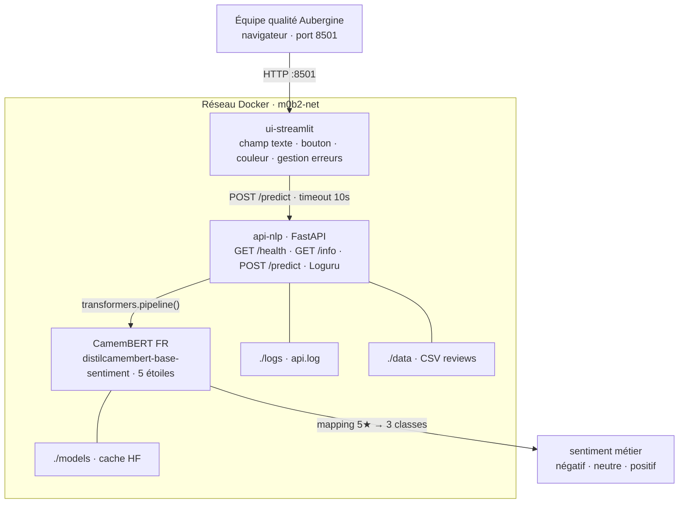

# M0-B2 — Squelette : sentiment FR Aubergine Hôtels

## Architecture
 


## How to

Stack `docker compose` à 2 services qui démarre dès le clone (healthcheck inclus).

```bash
# 1. Configurer l'environnement
cp .env.example .env

# 2. Construire et lancer la stack
docker compose up --build

# 3. Vérifier
curl http://localhost:8000/health        # API NLP
open  http://localhost:8501              # UI Streamlit
```

À l'arrêt : `Ctrl+C` puis `docker compose down` (les volumes `models/` et
`logs/` sont conservés — le modèle HF n'est pas re-téléchargé au prochain `up`).

> ⏱️ Le **1ᵉʳ démarrage** prend 3-5 min de build + 1-3 min de download du
> modèle CamemBERT (~270 Mo). Les démarrages suivants sont < 30 s grâce au
> cache volume `models/`.

---

## Modèle utilisé

**`cmarkea/distilcamembert-base-sentiment`** — DistilCamemBERT FR, 68 M paramètres, ~270 Mo.

⚠️ Le modèle sort **5 étoiles** (`'1 star'` … `'5 stars'`). Le métier (Aubergine Hôtels) veut **3 classes** (`négatif/neutre/positif`).

→ Le mapping est implémenté dans `services/api-nlp/app/inference.py` :
`1-2★ → négatif | 3★ → neutre | 4-5★ → positif`.

---

## Justification du seuil de mapping 5★ → 3 classes
 
### Mapping retenu
 
| Étoiles brutes | Classe métier |
|---|---|
| 1 étoile | **négatif** |
| 2 étoiles | **négatif** |
| 3 étoiles | **neutre** |
| 4 étoiles | **positif** |
| 5 étoiles | **positif** |

### Argumentation
 
**Argument 1 — Asymétrie du coût d'erreur.**
Un faux négatif (une review 1 ou 2 étoiles classée "neutre" ou "positif") a des conséquences directes :
un client mécontent non détecté peut faire éclater un scandale publique, dégradant l'image de l'établissement.
Le seuil est donc volontairement sensible côté négatif : regrouper 1 et 2 étoiles.

**Argument 2 — Distribution des étoiles.**
Sur un corpus de reviews hôtelières réelles, la distribution typique est polarisée : beaucoup de 5 étoiles et 1 étoile, peu de 3 étoiles. Regrouper 1-2 étoiles en "négatif" et 4-5 étoiles en "positif" produit une distribution équilibrée et exploitable des 3 classes.
 
**Alternative écartée : 1★ seul → négatif, 2-3★ → neutre.**
Trop conservateur, des reviews 2 étoiles assez négatives ("personnel désagréable, chambre sale") passeraient en "neutre" et ne seraient jamais traitées en priorité.

---

## Endpoints

| Endpoint | Statut | Description |
|---|---|---|
| `GET /health` | ✅ fonctionnel | Statut + `model_loaded` |
| `GET /info` | ✅ fonctionnel | Métadonnées modèle, classes, contraintes |
| `POST /predict` | ✅ fonctionnel | Inférence → `négatif / neutre / positif` |

---

## Logging (Loguru)

### Configuration

Le sink fichier est configuré dans `services/api-nlp/app/main.py` :

```python
logger.add(
    "logs/api.log",
    rotation="5 MB",      # nouveau fichier au-delà de 5 Mo
    retention="7 days",   # suppression des fichiers > 7 jours
    compression="zip",    # archivage automatique des fichiers rotatés
    level="INFO",
)
```

Le volume `logs/` est monté dans le `docker-compose.yml` — les logs
persistent entre `docker compose down` et `docker compose up`.

### Format d'une ligne de log `/predict`

Chaque requête `/predict` produit une ligne dans `logs/api.log` :

```
2024-01-15 10:23:41.521 | INFO | app.main:predict:97 - predict | texte='Chambre très propre mais accueil déce...' | sentiment=négatif | latence=42.31ms
```

| Champ | Valeur | Note |
|---|---|---|
| `texte` | tronqué à **80 caractères** | RGPD-friendly — jamais le texte complet |
| `sentiment` | `négatif / neutre / positif` | classe métier mappée |
| `latence` | en millisecondes | temps d'inférence du pipeline HF |

> Les pings du healthcheck Docker (`GET /health`) sont filtrés et
> n'apparaissent **pas** dans les logs uvicorn, pour ne pas noyer les
> vrais signaux.

---

## Structure

```
.
├── docker-compose.yml             ← 2 services + healthcheck api-nlp
├── .env.example
├── services/
│   ├── api-nlp/                   ← FastAPI + transformers
│   │   ├── Dockerfile
│   │   ├── requirements.txt
│   │   ├── app/
│   │   │   ├── main.py            ← routes + configuration Loguru
│   │   │   ├── schemas.py         ← Pydantic ReviewIn / SentimentOut
│   │   │   └── inference.py       ← mapping 5★ → 3 classes
│   │   └── tests/
│   │       ├── test_health.py     ← sanité /health
│   │       └── test_predict.py    ← tests /predict (valide, 422, CSV)
│   └── ui-streamlit/              ← UI utilisateur
│       ├── Dockerfile
│       ├── requirements.txt
│       └── app.py
├── data/
│   └── sample_reviews.csv         ← 30 reviews FR fictives (Aubergine Hôtels)
├── logs/                          ← logs Loguru (volume persistant)
│   └── api.log
└── postman/
    └── M0-B2_collection.json      ← à compléter
```

---

## Healthcheck

Le `docker-compose.yml` inclut un `healthcheck` sur `api-nlp`. Au bout de ~40 s (le temps que le modèle se charge), le service passe `healthy`.

```bash
docker compose ps
# m0b2-api-nlp        Up X seconds (healthy)
```

---

## Tests

La suite pytest couvre 3 cas pour `/predict` dans `tests/test_predict.py` :

| Test | Description | Résultat attendu |
|---|---|---|
| `test_predict_valid_returns_200_and_valid_structure` | Review valide | 200 + `SentimentOut` conforme (sentiment, scores 5★, latence) |
| `test_predict_invalid_input_returns_422` | Texte vide, texte blanc, > 2000 chars, payload sans champ | 422 pour chaque cas |
| `test_predict_csv_reviews_returns_200_and_valid_structure` | 3 reviews chargées depuis `data/sample_reviews.csv` | 200 + `SentimentOut` conforme pour chacune |

Lance les tests **dans le conteneur API** :

```bash
docker compose exec api-nlp pytest -v
# 9 passed in X.XXs
```

> **Note** : le `TestClient` utilise `scope="session"` — le pipeline HF est
> chargé une seule fois pour toute la suite, ce qui évite de recharger le
> modèle entre chaque test.

---

## Variables d'environnement (`.env`)

| Variable | Défaut | Usage |
|---|---|---|
| `MODEL_NAME_HF` | `cmarkea/distilcamembert-base-sentiment` | Modèle HF à charger |
| `MAX_TEXT_LENGTH` | `2000` | Validation Pydantic (longueur max texte) |

---

## Débugging rapide

| Symptôme | À tenter |
|---|---|
| `docker compose up` reste bloqué | 1ᵉʳ build = 3-5 min + 1-3 min download modèle, patiente |
| `/predict` renvoie 501 | `inference.py` pas encore complété |
| `/predict` renvoie `"1 star"` | Mapping 5→3 pas implémenté |
| L'UI affiche « API non branchée » | Compléter `app.py` dans `services/ui-streamlit/` |
| `Connection refused` depuis l'UI | URL doit être `http://api-nlp:8000`, pas `localhost` |
| `ModuleNotFoundError` | `docker compose build --no-cache api-nlp` |
| Service `unhealthy` | `docker compose logs api-nlp` |
| `logs/api.log` vide | Lance au moins une requête `/predict` via Swagger ou Postman |
| Trop de lignes dans les logs | Les pings `/health` sont filtrés — normal de ne pas les voir |
| Tests `/predict` échouent avec `pipeline=None` | Vérifier que `TestClient` est utilisé avec `with` (lifespan requis) |

### Lire les logs en temps réel

```bash
# Logs de l'API (uvicorn + Loguru stderr)
docker compose logs -f api-nlp

# Fichier de log persistant (sink Loguru)
tail -f logs/api.log

# Dernières requêtes /predict uniquement
grep "predict" logs/api.log | tail -20
```
